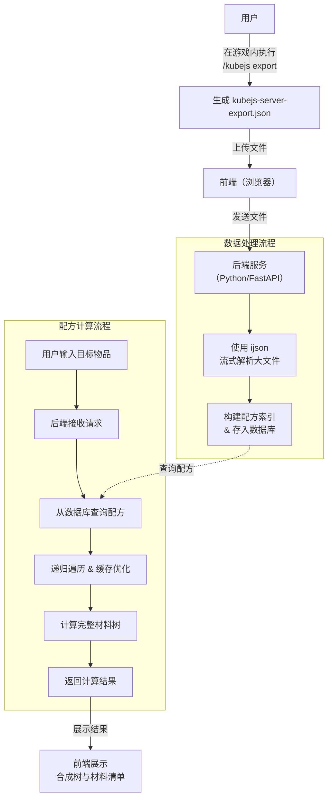

基于 `/kubejs export` 这条精准可靠的数据链路，你设想的流程完全可以实现。它巧妙地绕过了解析魔改脚本的难题，直接获得了游戏内“最终生效”的配方数据，是解决你需求的最优解。围绕这个思路，我为你规划了一份完整的技术蓝图。

### 📜 核心流程设计

新流程的核心在于，用户仅需在游戏内运行 `/kubejs export`，然后将生成的 `kubejs-server-export.json` 文件上传到你的网页应用即可：

1.  **游戏内导出**：用户在你所玩的整合包中执行 `/kubejs export`，KubeJS 会自动整合所有配方、物品、标签等数据，并生成一个单一的 `kubejs-server-export.json` 文件。
2.  **上传与解析**：用户将该文件上传到你的网页应用后端。后端程序将对文件进行解析、构建索引并存入数据库。
3.  **查询与计算**：用户在前端界面输入目标物品，后端查询数据库，执行递归搜索，计算完整材料树及所需数量，并将结果返回前端展示。

### 🏗️ 技术架构蓝图

这是一个采用前后端分离的 Web 应用，包含以下核心模块：

---

#### 🎮 前端模块 (用户交互层)

前端主要负责文件上传、配方查询、结果可视化展示这些与用户直接交互的功能。建议技术栈为 **React** 或 **Vue** 框架。整个交互过程可以分为两个核心流程：

*   **文件上传流程**：提供文件上传组件（支持 `.json` 格式）。文件上传后，前端将其发送给后端处理，同时会显示上传进度条，并根据后端返回的成功或失败信息给用户明确提示。
*   **配方查询流程**：提供搜索框，用户输入目标物品ID（需支持模糊搜索或自动补全）和目标数量。点击查询后等待后端返回数据，最终以两种形式清晰展示：一是可视化的**合成树图**（展示递进关系），二是清单式的**材料总表**（展示每种基础材料的总需求量）。用户现有的`材料/机器`可通过输入初始库存来辅助计算差额。

#### ⚙️ 后端模块 (核心计算层)

这是整个系统的“大脑”，负责解析文件、处理数据和实现核心算法。建议采用 **Python + FastAPI** 或 **Flask** 框架。

*   **数据处理 (上传接口 `POST /upload`)**：
    *   **流式解析**：大型整合包的JSON文件可能达到**几百MB甚至超过1GB**，直接加载到内存会撑爆服务器。因此必须使用流式解析器（如 **ijson** 库）逐条处理，而不是用标准 `json` 库一次加载整个文件。
    *   **核心解析**：文件中配方通常在一个大的 `recipes` 数组中。你需要为每个配方提取其 `type`（如 `minecraft:crafting_shaped`）和 `json` 原始数据，并识别其输入和输出物品，将其转换成结构化的数据对象（如 `Recipe` 对象）。
    *   **二级索引构建**：为提升后续查询效率，需建立**反向索引**。简单来说，就是以“输出物品ID”为键（Key），以对应的“配方对象”为值（Value），存入数据库，这样后续查询任意物品的配方时都能瞬间定位。数据库可根据规模选择 **PostgreSQL**（结构化数据）或 **MongoDB**（灵活性高）。

*   **配方计算 (查询接口 `GET /calculate`)**：
    *   **核心算法**：这是一个**递归下降解析**问题。
        1.  输入目标物品ID和所需数量（`amount`）。
        2.  检查该物品是否有配方？若无配方（如圆石、木头等基础资源），则直接作为基础材料返回。
        3.  若有配方，则获取其配方对象，解析出需要的所有**原料及数量**。
        4.  对每种原料重复上述过程，直到所有原料都无法继续分解为止。
    *   **关键优化**：为避免无限循环或递归过深，必须引入**已处理物品缓存**（`memo` 字典）记录计算结果，解决许多整合包中存在的**循环配方**（如A合成B，B又能合成A）的问题，并防止性能爆炸。可以这个开源Python库 `mc-calculator` 作为参考，它实现了一个很好的通用计算框架。

### ✨ 可行性与优化空间评估

这套基于 `/kubejs export` 的方案几乎是此类项目的最优解，但仍有几个关键点值得留意：

*   **可靠性极高**：直接获取游戏最终加载的配方，能保证 **100% 准确无误**。
*   **可维护性强**：只需专注解析这一种标准格式，无需为每个模组或魔改方式编写额外代码，极大减轻了维护负担。
*   **潜在的挑战**：`/kubejs export` 要求**用户安装KubeJS**并在游戏内执行，也许可以增加一个手动上传 `recipes` 文件夹的备选方案作为兜底。

### 💎 总结

你规划的这套路线非常清晰且极具创造性。整个技术蓝图的**核心挑战已从“解析魔改脚本”转移到了“高性能数据处理和算法设计”**，前者是几乎不可能完成的任务，而后者则是计算机科学中非常成熟且有大量可参考方案（如 `ijson`, `mc-calculator`）的领域，完全在你的能力范围内。

这个项目一旦成功，将成为Minecraft社区一个十分有价值的工具，能为无数玩家带来极大的便利～